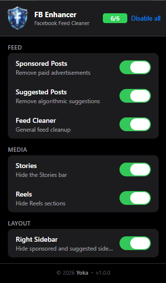
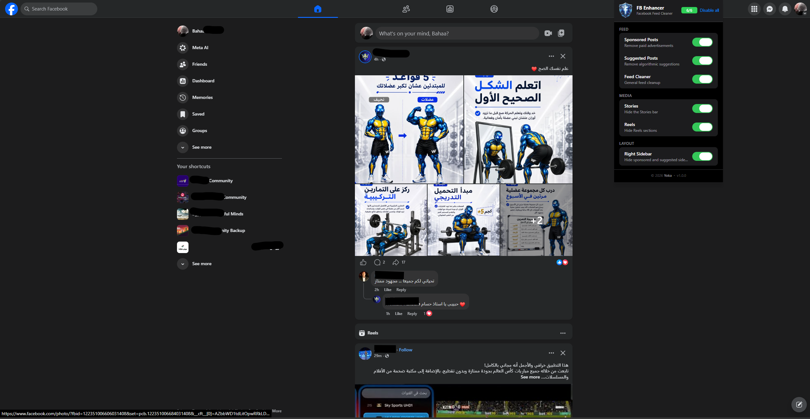
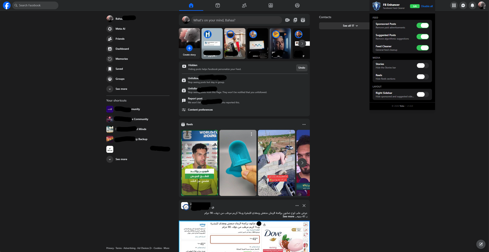

#  FB Enhancer



### Visual Comparison

|                                                Clean Feed Layout                                                |                                                 None clean Feed                                                  |
| :-------------------------------------------------------------------------------------------------------------: | :--------------------------------------------------------------------------------------------------------------: |
| <br>_Main feed fully cleaned of sponsored ads and layout clutter._ | <br>_Stories, Reels, and right sidebar panels are visible._ |

A lightweight, modern, and privacy-first browser extension that cleans up your Facebook feed and layout. Take back control of your social media experience by removing sponsored ads, algorithmic suggestions, stories, reels, and sidebar clutter.

Compatible with **Google Chrome**, **Microsoft Edge**, and all Chromium-based browsers.

---

## Features

**Feed**

- **Sponsored Posts** — Hides paid advertisements from the feed
- **Suggested Posts** — Removes algorithmic suggestions ("Suggested for you", "Suggested Groups", etc.)
- **Feed Cleaner** — General cleanup and normalization of the main feed

**Media**

- **Stories** — Hides the Stories bar at the top of the feed
- **Reels** — Hides Reels and short-video carousels

**Layout**

- **Right Sidebar** — Hides the right-hand column (sponsored blocks, suggestions, game invitations)

**Controls**

- Toggle each filter individually from the popup
- Enable All / Disable All with one click
- Settings persist across sessions and sync across your devices via browser sync
- Changes apply instantly — no manual refresh needed

---

## Installation (Developer Mode)

> For production installation, load from the Chrome Web Store or Microsoft Edge Add-ons store once published.

**Prerequisites:** [Node.js](https://nodejs.org/) v18+

```bash
git clone https://github.com/bahaayoussof/fb-enhancer.git
cd fb-enhancer
npm install
npm run build
```

Then:

1. Open `chrome://extensions/` (Chrome) or `edge://extensions/` (Edge)
2. Enable **Developer Mode**
3. Click **Load unpacked**
4. Select the `dist/` folder

---

## Development

```bash
npm run dev       # Vite watch mode — rebuilds on file changes
npm run build     # Production build → dist/
npm run package   # Build + ZIP for store submission
npm run lint      # ESLint static analysis
npm run format    # Prettier formatting
```

---

## Privacy

**FB Enhancer collects no user data.**

- No analytics, no telemetry, no tracking
- No external servers or APIs
- No browsing history or page content is read or transmitted
- Settings are stored locally using the browser's built-in Storage API
- All processing happens on your device

[Read the full Privacy Policy →](https://zokavic1.github.io/fb-enhancer/privacy-policy)

---

## Permissions

| Permission                       | Why it is needed                                                            |
| -------------------------------- | --------------------------------------------------------------------------- |
| `storage`                        | Saves your toggle preferences so they persist between sessions              |
| `host_permissions: facebook.com` | Required to inject the content script that hides elements on Facebook pages |

No other permissions are requested. `activeTab`, `tabs`, `scripting`, `cookies`, `history`, and `webRequest` are intentionally **not** requested.

[Read the full Permission Justification →](https://zokavic1.github.io/fb-enhancer/permissions)

---

## Browser Compatibility

| Browser                                     | Supported                             |
| ------------------------------------------- | ------------------------------------- |
| Google Chrome 88+                           | ✓                                     |
| Microsoft Edge 88+                          | ✓                                     |
| Brave                                       | ✓                                     |
| Opera                                       | ✓                                     |
| Any Chromium-based browser with MV3 support | ✓                                     |
| Firefox                                     | ✗ (uses MV2, not currently supported) |

---

## License

MIT — see [LICENSE](./LICENSE)
